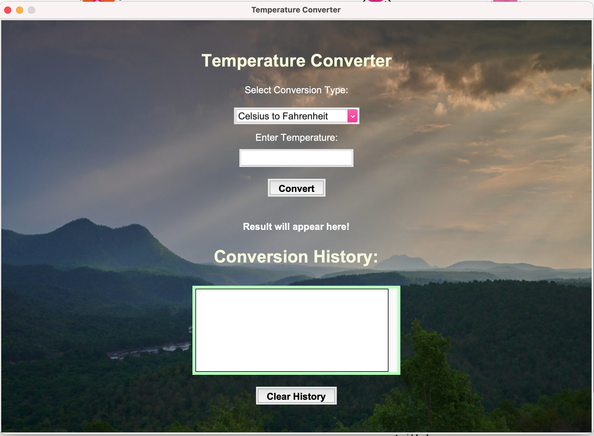
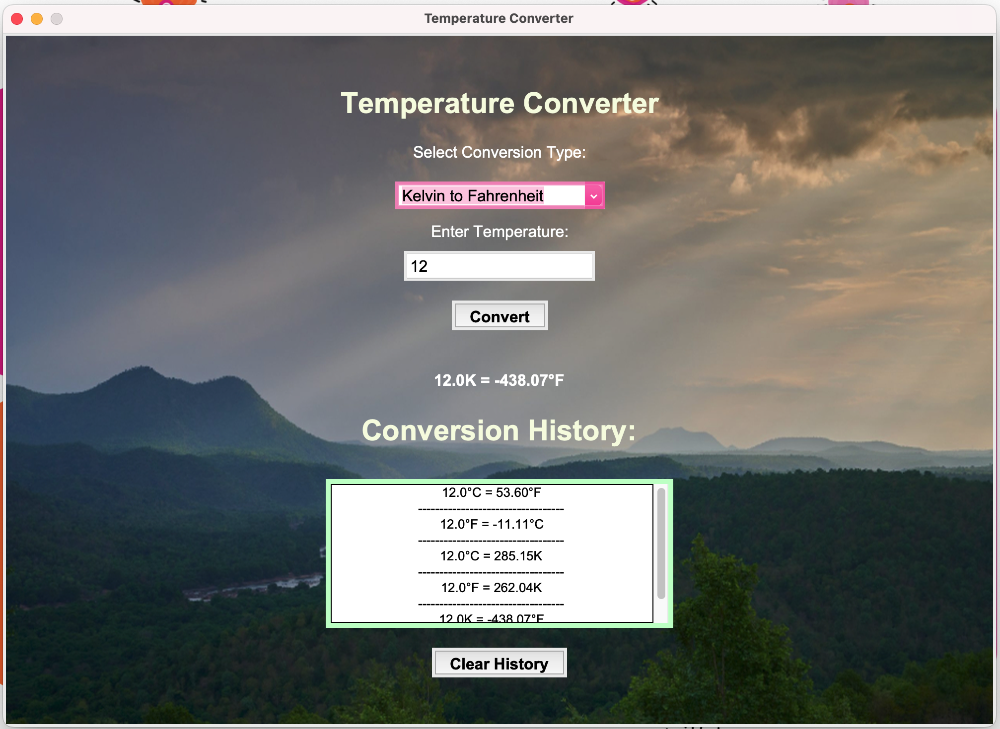

# Temperature Converter App 🌡️

A user-friendly GUI-based application for converting temperatures between **Celsius**, **Fahrenheit**, and **Kelvin**, built using **Python** and **Tkinter**.

---

## Features ✨

- Convert between **Celsius**, **Fahrenheit**, and **Kelvin**.
- User-friendly interface with dropdown for selecting conversion type.
- Displays the conversion **result** dynamically.
- Maintains a **conversion history**.
- Option to **clear the history** and reset the application.

---

## Installation 🛠️

1. Clone the repository:
   ```bash
   git clone https://github.com/your-username/temperature-converter-app.git
   cd temperature-converter-app

2. Install the required dependencies:
- pip install -r requirements.txt

3. Ensure the background.jpg file is placed in the asset/img/ directory.

4. Run the application:
    python temperature_converter.py
    
## Usage 🚀
- Launch the application.
- Select the desired conversion type from the dropdown menu.
- Enter the temperature value in the input field.
- Click the Convert button to display the result.
- View the conversion history in the history section.
- Use the Clear History button to reset the history and result.

## Screenshots 🖼️
1. Main Screen


2. Conversion History



## File Structure 📂

    temperature-converter-app/
    ├── asset/
    │   └── img/
    │       └── background.jpg
            └── main_screen.png
            └── history_screen.jpg
    ├── temperature_converter.py
    ├── basics.py
    ├── requirements.txt
    ├── README.md
    
## Dependencies 📦
1. Python 3.x
2. Virtual Environment (optional)
2. Tkinter (included with Python)
3. Pillow (for image handling)

## Install dependencies using:
- pip install Pillow
    
## Customization 🎨
Background Image: Replace asset/img/background.jpg with your preferred image.
Styles and Colors: Modify styles directly in the temperature_converter.py file (e.g., button colors, fonts, etc.).
Understanding Core Logic: For basic understanding of core logic, simple basic code is also attached in basics.py.
    
## Contributing 🤝
Contributions are welcome! Feel free to submit a Pull Request or open an Issue to improve this project.

## License 📄
This project is licensed under the MIT License. See the [LICENSE](LICENSE) file for more details.

## Contact 📧
For any queries, feel free to reach out 😊:
- GitHub: Maham-Wajid
- Email: maham00079@gmail.com
